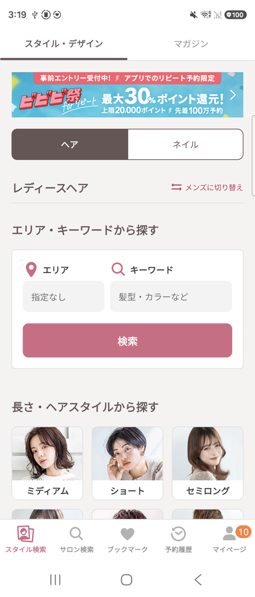
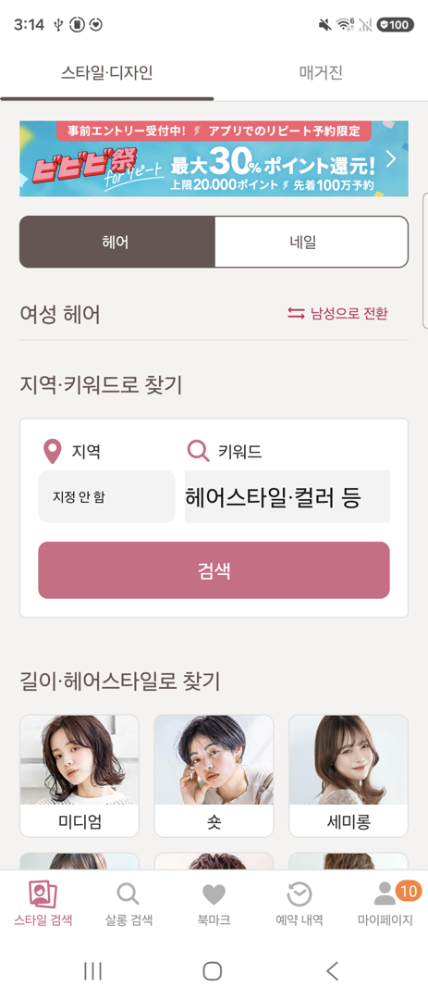
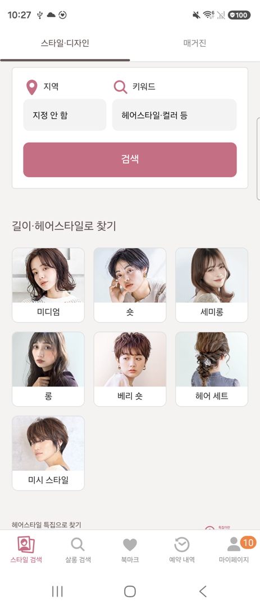
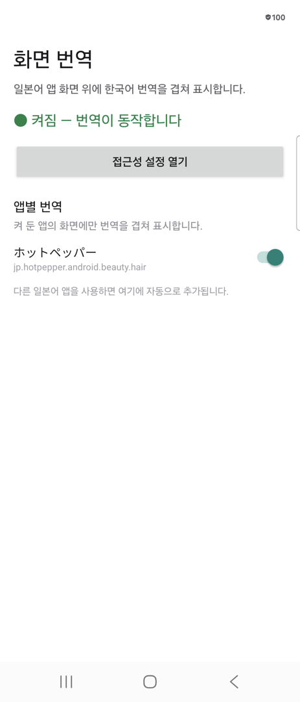
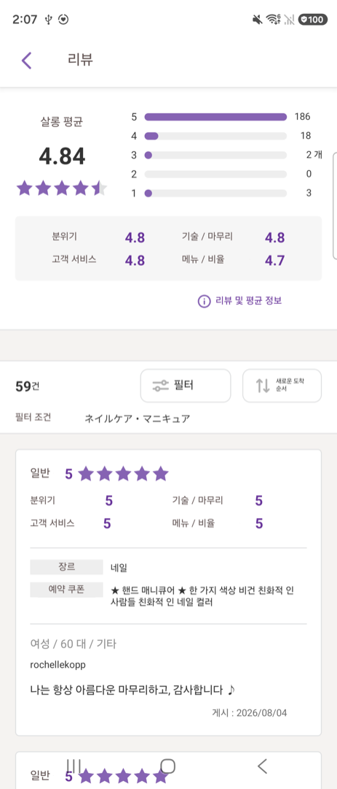
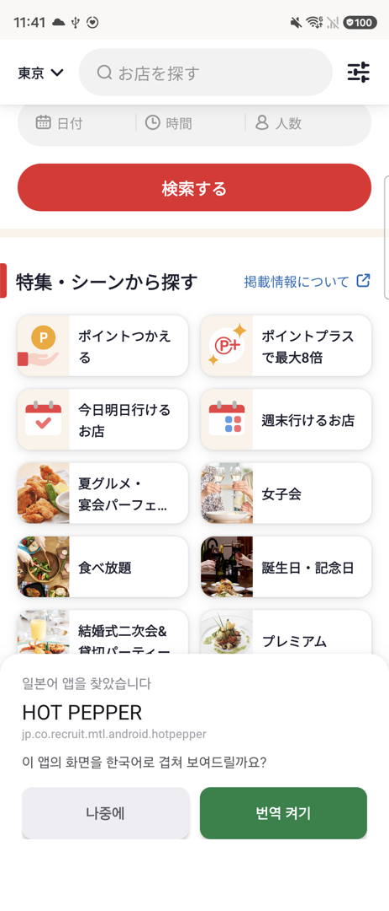
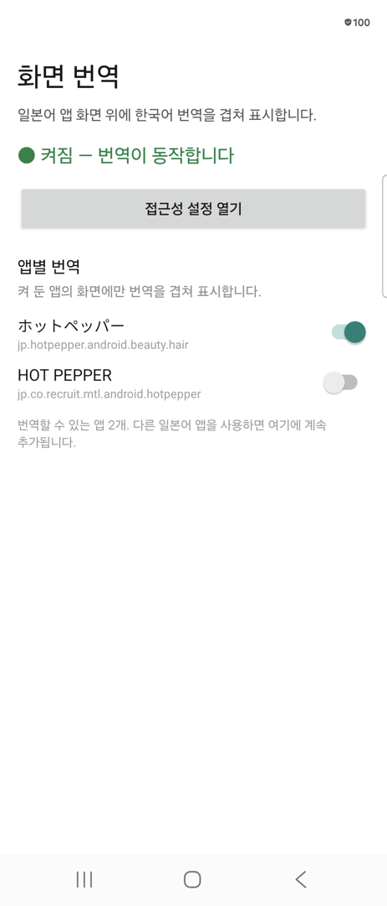

# screen-translator
### 앱을 보던 그대로, 일본어만 한국어로 바뀝니다. 

#### 🇰🇷 예약, 리뷰 확인, 메뉴판까지- 평소에 쓰던 어플처럼 편하게 이용하세요.

- 번역을 위해 화면을 캡처하거나 별도의 전환 없이 바로 사용할 수 있습니다.
- 접근성 트리에서 문자열과 좌표를 가져와, 해당 위치에 **한국어 해석을 오버레이로 보여줍니다.**

## 다운로드

[**최신 릴리스에서 APK 받기 →**](../../releases/latest)

`arm64-v8a` 를 받으세요. 2019년 이후 안드로이드 폰은 거의 다 여기에 해당합니다.
설치가 안 되면 `universal` 을 받으시면 됩니다.

### 설치 후 접근성 권한 켜기

Android 13 부터 **Play 스토어 밖에서 설치한 앱**은 접근성 권한을 바로 켤 수 없습니다.
설정에서 켜려 하면 막히므로 제한을 먼저 풀어야 합니다.

1. 설정 → 애플리케이션 → **화면 번역**
2. 우측 상단 **⋮** → **제한된 설정 허용**
3. 설정 → 접근성 → 설치된 앱 → **화면 번역 오버레이** 켜기

앱을 열면 현재 상태와 앱별 번역 목록을 볼 수 있습니다.

## 화면
오버레이 적용 before & after 화면입니다. 


| 원본 | 오버레이 적용 |
|---|---|
|  |  |

카드가 격자로 늘어선 화면에서도 각 항목의 라벨 위치를 그대로 따라갑니다.

| 스타일 검색 화면 | 앱 실행 화면 |
|---|---|
|  |  |

숫자와 글자가 촘촘히 섞인 화면에서도 각 값이 제자리를 지킵니다. 별점 막대의 수치, 항목별
점수, 리뷰 본문이 원문과 같은 크기·같은 색으로 그려집니다.

| 리뷰 화면 |
|---|
|  |

> 스크린샷의 대상 앱은 예시로 사용한 서드파티 [hot-pepper-beauty](https://play.google.com/store/apps/details?id=jp.hotpepper.android.beauty.hair&hl=ko)✨ 어플입니다.

## 기술 스택

- Kotlin
- Android AccessibilityService
- Android WindowManager 
- Canvas 기반 오버레이 렌더링
- ML Kit Translate (`ja -> ko`)
- Gradle, AGP, Android SDK

## 사용 방법

1. 앱을 설치한 뒤, 권한 안내에 따라 접근성 권한을 허용합니다.
2. 권한을 켜두면 이후에는 화면의 일본어를 자동으로 감지하고, 새 앱을 찾으면 보고 있던 화면 아래에 바텀시트로 물어봅니다.
3. 번역을 켜 둔 앱에서는 인식한 텍스트 자리에 한국어 해석을 그대로 겹쳐 보여줍니다.
4. 번역을 켜지 않았더라도 앱의 **앱별 번역** 목록에서 나중에 켤 수 있습니다.

| 2번 — 새 앱을 찾았을 때 | 4번 — 켜지 않고 넘어간 앱 |
|---|---|
|  |  |

왼쪽에서 **나중에**를 눌러도 오른쪽 목록에는 행이 남습니다. 스위치가 꺼져 있으니
그 앱에서는 번역이 동작하지 않고, 켜고 싶어지면 이 목록에서 켜면 됩니다.

### 앱별 번역

진짜 일본어 앱인지 먼저 판별한 뒤에만 번역 기능을 활성화합니다.

- 일본어가 충분히 확인되면 어플을 감지하고, 목록에 자동으로 추가됩니다.
  
  - 화면에 히라가나·가타카나가 하나 이상 존재 (한자만으로는 중국어와 구분되지 않음)
  - 일본어 노드 4개 이상, 그리고 화면 텍스트 노드의 40% 이상일 것
  - 위 조건을 만족하는 서로 다른 화면을 2개 이상 본 앱만 번역이 필요한 것으로 간주합니다.
  


## 빌드

```bash
./gradlew installDebug          # 빌드 + 설치. adb install 따로 안 해도 됨
./tools/dev.sh enable           # 접근성 재허용 (재설치시 권한 재부여 필요)
./tools/dev.sh log              # adb logcat -s ScrTrans
./tools/dev.sh shot out.png     # 디스플레이 ID를 명시한 screencap
```


이 기기에서 검증된 툴체인:

| 항목                              | 버전 / 설정                                      |
| ------------------------------- | -------------------------------------------- |
| JDK                             | 21.0.5                                       |
| Android SDK                     | `platforms;android-36`, `build-tools;36.0.0` |
| AGP / Kotlin / Gradle           | 8.13.2 / 2.3.21 / 8.14.5                     |
| compileSdk / targetSdk / minSdk | 36 / 36 / 30                                 |
| ML Kit Translate                | `com.google.mlkit:translate:17.0.3`          |


> 최초 실행 시 ML Kit 번역 모델 다운로드를 위해 네트워크 연결이 필요합니다.
> 다운로드 이후에는 오프라인에서도 사용할 수 있습니다.


